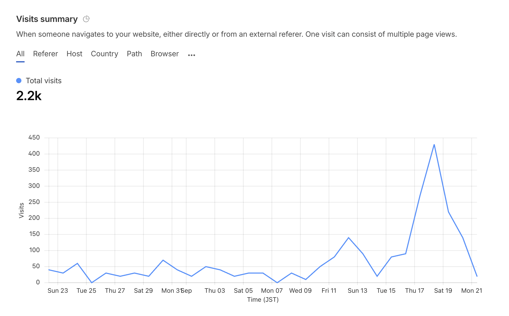
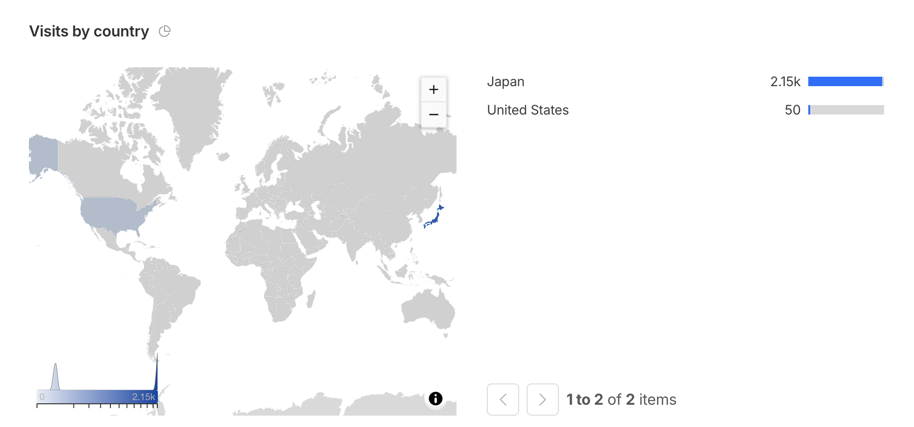
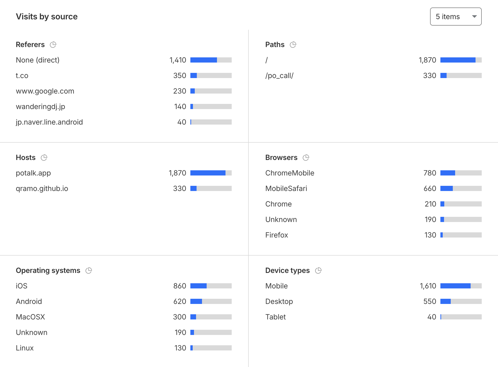

# 🫖 ぽっと通話 (potalk)

同じ部屋名（URL）を開いた人どうしが、そのまま音声通話できる実験的な**静的Webページ**。
サーバ不要・**HTML1枚**（WebRTC 音声 ＋ [Trystero](https://github.com/dmotz/trystero) / Nostr）。既定はプライバシー配慮で **Cloudflare TURN 中継**を通し、相手に自分の IP が見えないようにしている。

**👉 使ってみる： https://potalk.app/**

> 実験用プロジェクトです。利用で生じた不具合・不利益・損害は自己責任で。一般的なモラルを守ってお使いください。

このREADMEは2部構成です：
- **使いたい人へ** … アプリを開いて通話するだけ
- **自分で立てたい人へ** … クローンして自前で動かす／公開する（技術者向け）

---

## 👥 使いたい人へ

**[▶ アプリを開く](https://potalk.app/)** → 名前とアバターを決めて、部屋名を入れて「参加する」。
同じ部屋名（＝共有リンク／QRコード）を相手に渡すか、「通話中の部屋」からタップして入室。

**できること**
- 🧑 名前＋絵文字アバター（ブラウザに保存、次回も引き継ぐ）
- 🗣 話している人の絵文字が声に合わせて跳ねる
- 🔇 参加者のミュート状態を表示
- ☎️ 通話中の部屋を一覧、タップでそのまま入室
- 💬 ひとこと（短いテキスト）とリアクション絵文字。ひとことは流れとしても残る
- 📣 **配信部屋**：あなただけが話し、ほかの人は聞き役。聞き役はマイクを使いません（許可も求められません）。話してほしい人には 🎙 で登壇を許可できます
- 👥 いまこのページを見ている人数のめやす
- 🌱 使うほど自分の絵文字が育つ
- 🫖 常設の部屋：案内が流れる「POへようこそ」と、声が5秒で返る接続テスト「やまびこ部屋⛰️」

**つかう前に**
- **マイクの許可**が必要。**Safari / Chrome** で開く（アプリ内ブラウザは不可）
- iPhoneでは「音声を有効化」ボタンが出ることがある
- 人数の上限は **ふつうの部屋8人／📣配信部屋15人**（全員が全員に繋がる仕組みなので、多いほど音が途切れます）
- 実験版なので切断・不具合が起きることがあります
- くわしくはアプリ内の「これはなに？」を参照

**💬 ご意見・質問・不具合報告**
掲示板へどうぞ（**アカウント不要・匿名OK**・みんなで助け合おう）：
**[ぽっと通話 ご意見・質問ばん ↗](https://z.wikiwiki.jp/potalk/)**
※ 掲示板は外部サービス（[zawazawa ↗](https://z.wikiwiki.jp/)）を利用しています。

---

## 🛠 自分で立てたい人へ

### 構成
- **`index.html` 1枚**。ビルド無し・`node_modules` 無し・バックエンド無し。
- 依存は [Trystero](https://github.com/dmotz/trystero) 1つだけを、実行時に `esm.sh` から動的 `import`。
- 相手発見／シグナリングは公開 **Nostrリレー**、音声は **WebRTC（ブラウザ間 E2E 暗号化）**。**既定は Cloudflare TURN 中継経由**（`iceTransportPolicy:'relay'`）で、相手に自分の IP が見えないようにしている。TURN 資格情報が取れないときだけ通常の P2P/STUN にフォールバック（後述）。
- 「ロビー（通話中の部屋一覧）」も固定の隠し部屋 `__lobby__` に全員が入り、通話中の人が在室を定期発信して集約する仕組み。**サーバは足していません。**
- 「いま見ている人数」も同じロビーに相乗り。ページを開いた人は通話に入っていなくても `__lobby__` のメッシュに繋がるので、`onPeerJoin`/`onPeerLeave` でピアを数えて `+1`（自分）するだけ。**カウンタ用のサーバも API も無し。**

### ローカルで動かす
`getUserMedia`（マイク）は **https:// か localhost** でしか動かない（`file://` 不可）。

```bash
python3 -m http.server 8000
# → http://localhost:8000 を開く
```

ビルド・lint・test は無し。**2タブ／2端末**で同じ部屋名を開いて繋がればOK。

### 自分の GitHub Pages で公開
1. リポジトリに push
2. **Settings → Pages → Deploy from a branch → `main` / `/(root)`**
3. 数分後 `https://<user>.github.io/<repo>/` で公開（Pages は自動 HTTPS ＝ マイク許可が通る）

### ⚠️ フォークしたら差し替えるもの
そのままデプロイすると**あなたの環境では一部が動きません**。`index.html` 内の以下を自分のものに：

| 項目 | 何が起きる／どうする |
|---|---|
| **TURN Worker URL**（`TURN_WORKER_URL`） | 既定は作者の Cloudflare TURN 資格情報発行 Worker で、**CORS で作者のオリジンに限定**。別オリジンからは弾かれ、**TURN が効かず別ネットワーク間で繋がらない**（STUN のみ＝直結できるペアだけ繋がる）。自分の Worker を用意して URL を差し替え、Worker 側の CORS 許可に自分のオリジンを追加する（下記）。 |
| **`appId`**（`kuramo-webrtc-call`） | 同じ `appId` だと**本家と部屋の名前空間・ロビーを共有**します。独立させたいなら変更。 |
| **Cloudflare Analytics トークン** | `<head>` のビーコンは作者のもの。自分のに差し替えるか、まるごと削除。 |
| アイコン / `manifest.webmanifest` / フォローカード画像 | 好みで差し替え。 |

### Cloudflare TURN（中継の既定・安定させたい人向け）
本アプリは**既定で音声を必ず TURN 中継**に通します（`iceTransportPolicy:'relay'`）。狙いは **IP プライバシー**（中継なら相手に自分の実 IP が見えない。音声は中継でも DTLS-SRTP で暗号化されたままで、Cloudflare も中身は聞けない）。あわせて対称NAT・セルラーなど直 P2P が張れない環境の救済も兼ねます。無料の公開 TURN は不安定なので、**Cloudflare Realtime TURN ＋ 短命の資格情報を発行する小さな Worker**を推奨（Worker は "合鍵を渡すだけ" で通話は通らない＝運営は通信経路を持たない）。 **この Worker のソースは [`worker/pot-turn.js`](worker/pot-turn.js) に同梱しています**（シークレットは環境変数なので、そのまま自分の Cloudflare に貼って使えます）。

- Cloudflare ダッシュボード → Realtime → **TURN Server** で TURN キー（Key ID / API Token）を作成
- Worker が `POST https://rtc.live.cloudflare.com/v1/turn/keys/$KEY_ID/credentials/generate-ice-servers`（`Authorization: Bearer $API_TOKEN`）を叩いて `iceServers` を返す。CORS で自分のオリジンだけ許可
- ページは起動時にその Worker から `iceServers` を取得し、`rtcConfig.iceServers` として Trystero に渡す
- **relay は資格情報が取れた時だけ**：`trysteroConfig` は `ice` が truthy のときだけ `iceTransportPolicy:'relay'` を付ける。取れないと候補ゼロで全員不通になるため、その場合は relay を外して通常の P2P/STUN にフォールバックする（安全網）
- 参加者リストの **☁️（中継）/ ↔（直結）アイコン**で、各自が中継経由か直結かを自己申告表示（自分の IP が相手に見えるかの可視化）

### Trystero 0.25 系メモ
ネット上の情報の多くは旧 API なので注意：

- **コールバックは代入**：`room.onPeerJoin = id => {}`（`onPeerJoin(fn)` の呼び出し形は廃止）
- **サブパス import は例外**：`trystero/torrent` 等は不可。素の `trystero` は **nostr** 戦略（本アプリはこれ）
- **リレー指定**：`relayConfig:{ urls:['wss://...'], redundancy:N }`。平坦な `relayUrls` / `relayRedundancy` は**無視**される（なお **`urls` を渡すと `redundancy` は効かない**＝渡した一覧が全部使われる。0.25.2 のソースで確認）
- **ICE 指定**：丸ごと差し替えるなら `rtcConfig:{ iceServers:[...] }`。`turnConfig:[{urls,username,credential}]` は既定 STUN に**追加**
- **relay 強制（本アプリの既定）**：`rtcConfig:{ iceServers:[...], iceTransportPolicy:'relay' }` で常に TURN 中継のみ（直 P2P しない＝IP を隠す用途）

### スケール / 注意
- **フルメッシュ**（全員が全員に接続）＝部屋の接続数は N(N-1)/2 で増える。**上限を明示的に置いている**（ふつうの部屋8人・配信部屋15人）。大人数は SFU（LiveKit 等）が必要で、それは「越えない」と決めた境界。
- 満室のときに抜けるのは**あとから入ってきた側だけ**（到着順で判定）。全員が同じ判定を回すと全員が抜けてしまうため。
- ロビーも**閲覧者全員**のデータメッシュ。効くのは通話人数ではなく同時閲覧者数で、**数十人規模で頭打ち**（伸ばすなら Nostr 直 publish 等のサーバレスな方式へ）。
- 「いま見ている人数」はそのメッシュを数えているだけなので **best-effort**。繋がれなかった相手は数に入らず**実数より少なめに出る**（5人きざみに丸め、5人未満を「数人」と濁しているのはそのため）。
- 音声は **E2E 暗号化**（DTLS-SRTP）。**既定の Cloudflare 中継を経由してもバイト列を運ぶだけで中身は復号されず**、運営の設備も通らない。シグナリングは Nostr 公開リレー経由。

---

## 📅 これまでの歩み

- 2026/07/15 POPOPO の終了が発表される。ぽっと通話を構想
- 2026/07/16 ぽっと通話をローンチ（GitHub で作成・公開）
- 2026/07/17 POPOPO の知り合いと遊び始める
- 2026/07/18 通話中の部屋を実装。「誰がいて・誰が話していて・どの部屋がライブか」を可視化
- 2026/07/19
    - 絵文字が育つ成長機能（🌱→🌿→🌷→🌲/🌳）を追加
    - QRコード表示とプロフィールの折りたたみを追加
    - 「これはなに？」ヘルプをモーダル化
    - TURN を Cloudflare へ切り替え
- 2026/07/20 ヘルプを拡充し、README を2部構成に整備
- 2026/07/21
    - 公開・告知を開始（POPOPO プロフィールにリンクを掲載）
    - ChatGPT に[レビューをもらった](https://chatgpt.com/share/6a5ef1cf-9d04-83e8-9724-c0faccb27bb0)
    - スマホの表示領域を有効活用（枠を外して全幅化）
    - 参加後は不要な入力フォーム（名前・部屋名）を畳むように
    - 共有 URL は見た目を一行に省略
    - 「これはなに？」をスクロール優先にし、説明トグルは開くたびリセット
    - コードが1000行を超える
- 2026/07/22
    - 長い部屋名を制限（QRコードが細かくなり読みにくくなるため）
    - 部屋の継続時間を表示（最長在室者のタイマー基準のため、短くなることもある）
    - 部屋名と衝突して崩れていた人数表示を修正
- 2026/07/23
    - 部屋の音声状況に合わせた擬似グラフィックイコライザーを実装
    - OGP 画像を設定し、SNS シェアに対応
- 2026/07/24 — **v0.1.0**
    - P2P 優先をやめ、WebRTC を既定で中継経由に変更
    - 絵文字で代用していたパーツを画像化
    - ブログ等に貼れるアクティブバナーを実装
- 2026/07/25
    - 入退室の通知音を追加 🔈
    - 新しい部屋を検出したときの通知音を追加 🔈
    - 接続経路の表示（☁️中継 / ↔直結）を参加者リストに追加
- 2026/07/27
    - 開発の歩み（この一覧）を README にまとめた
    - ライセンスを MIT に決めて公開
    - アクセス状況を透明性のため公開
- 2026/07/28
    - 「POへようこそ」に自動再生の案内音声を設置（一人で来ても音が流れる）
    - サポート用の掲示板を用意し、「これはなに？」からリンク
- 2026/07/29
    - いまページを見ている人数を表示
    - 長時間つづく部屋の継続時間が他人からは24時間で頭打ちになっていたのを修正
    - 初めて来た人の名前とアバターをランダムに提案
- 2026/07/31 — **v0.5.0**（つながりやすさと安全性の回）
    - **「つなぎ直す」が実は繋ぎ直せていなかったのを修正**（ページを読み直す方式に変更）
    - 相手の声が届かないとき、**相手に「送り直して」と自動でお願いする**ようにした
    - 「音声を有効化」が用もないのに出て、押しても何も起きなかったのを修正
    - 壊れた URL で開くとアプリ全体が動かなくなるのを修正
    - 圏外・Wi-Fi オフのときに「インターネットに繋がっていません」と伝えるようにした
    - 回線が戻ったときに、通話中の部屋の一覧がすぐ復活するようにした
    - 参加ボタンの連打や、参加に失敗したときマイクが止まらない問題を修正
    - 部屋名に混ぜられた見えない文字で表示が崩される問題に対処
    - 公開リレーに流していた在室情報から名前を外した（絵文字だけに）
    - 外部レビューを2本もらい、指摘を反映。動作確認を自動化（手元の回帰テスト）
- 2026/08/02
    - 長い通話に後から入ると繋がらないことがある問題を修正（中継の資格情報を通話中に入れ替える）
    - 接続経路（中継／直接）の見かたを画面に出した
    - **`https://potalk.app/` へ引っ越し**（URL から個人名を外した。旧URLもそのまま使えます）
- 2026/08/03〜05
    - 引っ越しの後片づけ（ヘルプのリンクと表記を新しい名前・場所に揃えた）
    - 成長の花を 🌷 と 🌻 の2種類に分けた（短く何度も／長くときどき、で分かれます）
    - ロビーの一覧から部屋に入るときは、**マイクを切った状態で入る**ようにした
- 2026/08/14 — **v0.5.1**（静かに壊れていたものを直した回）
    - どれも「なんとなく不安定」としか見えていなかったものです
    - 繋がらなかった接続を閉じるようにした（溜まり続けてブラウザの上限に当たっていた）
    - **通話が20〜40分で突然切れる**のを修正（中継の資格情報の寿命が30分だった）
    - シグナリングのリレーを実測で入れ替え（**5本中4本が死んでいた**。部屋の取りこぼしの主因）
- 2026/08/15 — **v0.6.0**（相手ごとの「無視」とリアクション）
    - 参加者リストのハートで、**その人の音を受け取らない**ようにできる（相手には伝わりません）
    - 定型リアクション8つ。押した人のアバターから浮かび、音も鳴ります（音は切れます）
    - **つながりが切れたら、自分でつなぎ直す**ようにした（これまでは再読み込みが必要でした）
    - 「退出した」のか「接続が切れた」のかを書き分けるようにした
    - 旧URL `qramo.github.io/po_call/` は、**新機能を先に試す場**になりました（版の横に β が出ます）
- 2026/08/15 — **v0.7.0**（ひとこと）
    - **短いテキストを送れる**ようにしました。送ると、その人のアイコンから吹き出しが出ます
    - 履歴は残りません（後から入った人には見えません）。その場だけのものです
    - **無視した相手のひとことは出ません**（リアクションと同じ）
    - リアクションの音を絵文字ごとに作り分けました（拍手・クラッカーなど）
    - スマホで入力欄をタップすると画面が拡大する問題を修正
    - スマホでキーボードを出すと参加者リストの頭が見切れる問題を修正
- 2026/08/16 — **v0.8.0**（📣 配信部屋・ひとことの流れ・人数上限・画面の整理）
    - **📣 配信部屋**を追加。部屋名の下で選ぶと、**あなたの声だけが流れる部屋**になります
        - 聞き役で入った人は**マイクを使いません**（許可も求められません）
        - 話してほしい人には 🎙 で**登壇を許可**できます。許された人は「マイクを使う」を押して初めてマイクが入り、取り消すと自動で止まります
        - 共有リンクは**1種類だけ**。配信者かどうかは**部屋を作った端末**で決まります（配信者用の秘密のリンクはありません）
        - 「話してよい人」の一覧は配信者が**署名して配り**、各自のブラウザが確かめてから音を鳴らします。**名乗るだけでは配信者になれません**
    - **ひとことが流れとして残る**ようになりました（吹き出しは消えても、入力欄の上に残ります）
    - **人数の上限**を置きました（ふつうの部屋8人／配信部屋15人）。混んできたら先に知らせます
    - 通話中の画面を**タブ**に分けました（👥メンバー／💬ひとこと／⚙️設定）。高さが変わらないので、押す場所が動きません

---

## 📊 アクセス状況（透明性のため公開）

このアプリは [Cloudflare Web Analytics](https://www.cloudflare.com/web-analytics/)（**Cookie不使用・個人を特定しない匿名集計**）で**アクセス数だけ**を測っています。透明性のため、その集計を公開します。個々の通話内容・在室・音声は一切測っていません（そもそも測る仕組みがありません）。

**集計期間：2026/07/12〜07/25（JST）／累計訪問数：610**
数値は Cloudflare 側で10単位に丸められた概数、2026/07/26 時点のスナップショットです。公開した 7/19 以降に立ち上がり、告知を広げた **7/24 に約160/日でピーク**。



**国別**

| 国 | 訪問 |
|---|--:|
| 日本 | 590 |
| アメリカ | 20 |



**参照元（どこから来たか）**

| 参照元 | 訪問 |
|---|--:|
| なし（直接アクセス） | 450 |
| t.co（X / Twitter） | 80 |
| com.twitter.android | 30 |
| b.hatena.ne.jp（はてなブックマーク） | 20 |
| www.facebook.com | 20 |

**デバイス / OS / ブラウザ**

| デバイス | 訪問 | | OS | 訪問 | | ブラウザ | 訪問 |
|---|--:|---|---|--:|---|---|--:|
| モバイル | 410 | | iOS | 200 | | Mobile Safari | 200 |
| デスクトップ | 190 | | Android | 190 | | Chrome | 180 |
| タブレット | 10 | | macOS | 140 | | Chrome Mobile | 170 |
| | | | Windows | 30 | | Firefox | 10 |
| | | | 不明 | 30 | | 不明 | ※ |



※ ブラウザの「不明（Unknown）」は元画面で数値が隠れていたため未記載。すべてページ全体（当時のURL `qramo.github.io/po_call/`）へのアクセスです。

---

## 📄 ライセンス

[MIT](LICENSE) で公開しています。自由に使用・改変・再配布できます（著作権表示の保持が条件）。

利用・同梱している第三者ソフトウェアの著作権表示は [THIRD_PARTY_NOTICES.md](THIRD_PARTY_NOTICES.md) にまとめています ── [Trystero](https://github.com/dmotz/trystero)（MIT）、[qrcode-generator](https://github.com/kazuhikoarase/qrcode-generator)（MIT）、[nostr-tools](https://github.com/nbd-wtf/nostr-tools)（Unlicense）、アイコンは [Lucide](https://lucide.dev/)（ISC）。

---

🙏 テストに協力してくれたみんな、ありがとう！
- リョータさん
- アサコさん
- 田上光さん
- croutonさん
- hertzさん
- 名無しさん
- まを まをさん
- しーちゃんさん

制作 ♨️🦈 qramo(ｸﾗﾓ) on POPOPO ／ 開発は [Claude Code](https://claude.com/claude-code) / [OpenClaw](https://openclaw.ai) と一緒に。
